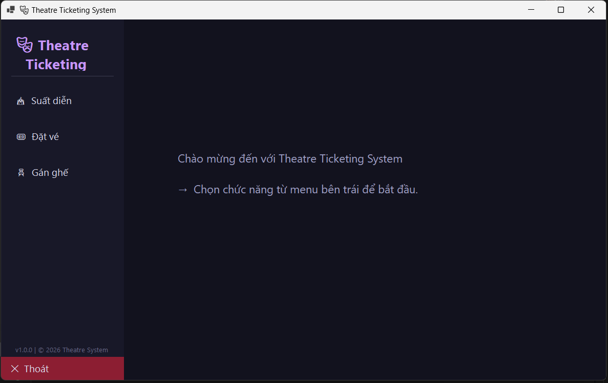
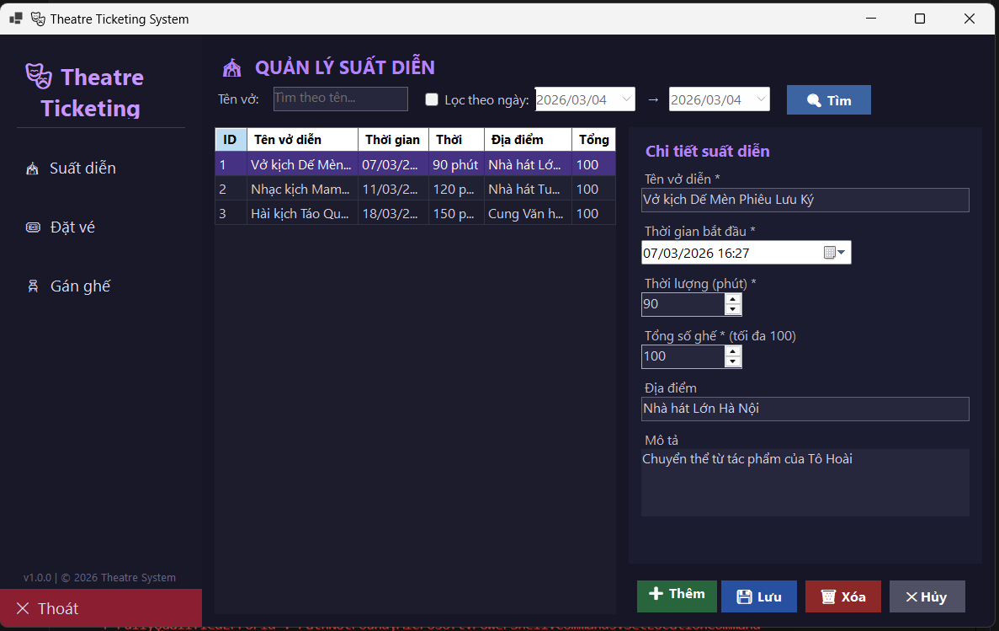
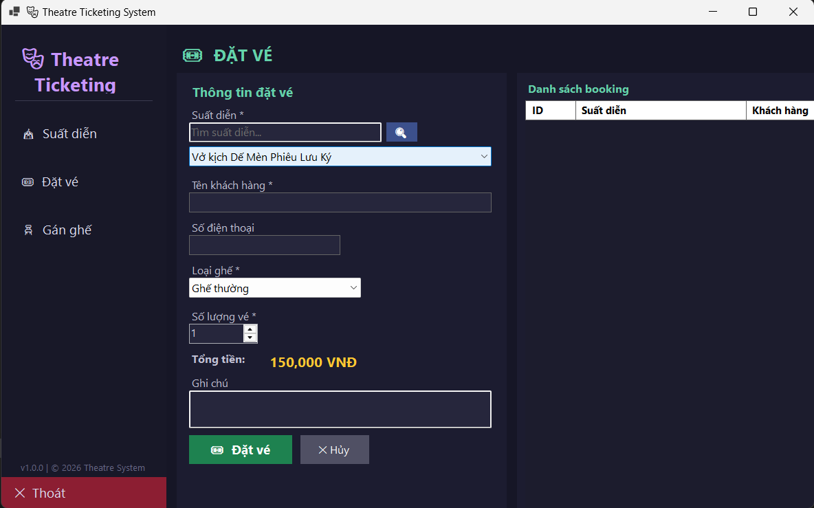
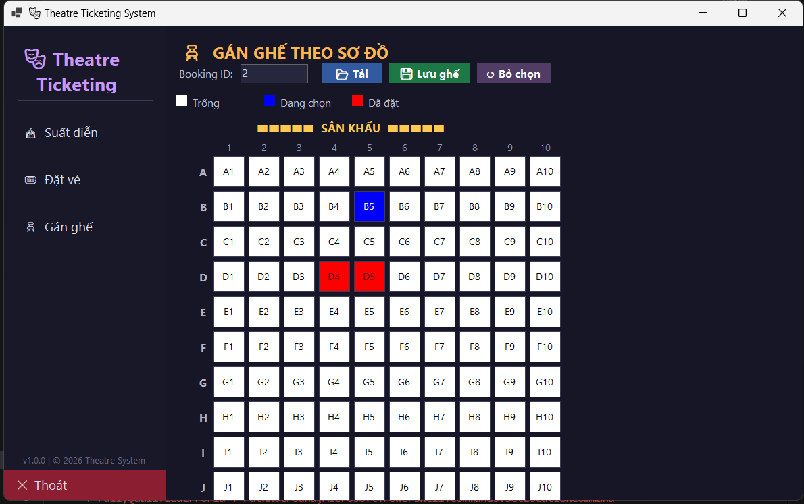

# Theatre Ticketing System

> Ứng dụng WinForms bằng **VB.NET (.NET 8)** + **PostgreSQL** mô phỏng hệ thống bán vé nhà hát.

---

## Mục lục

- [Yêu cầu hệ thống](#yêu-cầu-hệ-thống)
- [Cài đặt PostgreSQL và tạo database](#cài-đặt-postgresql-và-tạo-database)
- [Cấu hình kết nối](#cấu-hình-kết-nối)
- [Cách chạy chương trình](#cách-chạy-chương-trình)
- [Kiến trúc dự án](#kiến-trúc-dự-án)
- [Chức năng chính](#chức-năng-chính)
- [Thiết kế database](#thiết-kế-database)
- [Giả định và giới hạn](#giả-định-và-giới-hạn)

---

## Yêu cầu hệ thống

| Thành phần | Phiên bản tối thiểu |
|---|---|
| .NET SDK | 8.0 |
| Windows | 10 / 11 |
| PostgreSQL | 14+ |
| Visual Studio | 2022 (hoặc JetBrains Rider) |

---

## Cài đặt PostgreSQL và tạo database

### 1. Cài PostgreSQL

- Windows: tải tại [postgresql.org/download](https://www.postgresql.org/download/windows/)
- macOS: `brew install postgresql`

### 2. Tạo database

Mở **pgAdmin** hoặc **psql** và chạy:

```sql
CREATE DATABASE theatre_ticketing;
```

### 3. Chạy file schema

```bash
# Dùng psql
psql -U postgres -d theatre_ticketing -f TheatreTicketingSystem/Database/schema.sql
```

Hoặc mở file `Database/schema.sql` trong pgAdmin và thực thi toàn bộ.

---

## Cấu hình kết nối

Chỉnh sửa file `TheatreTicketingSystem/appsettings.json`:

```json
{
  "ConnectionStrings": {
    "DefaultConnection": "Host=localhost;Port=5432;Database=theatre_ticketing;Username=postgres;Password=YOUR_PASSWORD"
  }
}
```

> **Lưu ý:** Thay `YOUR_PASSWORD` bằng mật khẩu PostgreSQL của bạn.

---

## Cách chạy chương trình

### Option A – Visual Studio 2022

1. Mở solution `TheatreTicketingSystem.sln` (hoặc `.vbproj`).
2. Chọn **Build → Restore NuGet Packages**.
3. Nhấn **F5** (Debug) hoặc **Ctrl+F5** (Run without debug).

### Option B – .NET CLI

```bash
cd TheatreTicketingSystem
dotnet restore
dotnet run
```

---

## Kiến trúc dự án

Dự án áp dụng kiến trúc **phân tầng (Layered Architecture)**, lấy cảm hứng từ backend-dev-guidelines:

```
Forms (UI)
   ↓
Services (Business Logic)
   ↓
Repositories (Data Access)
   ↓
PostgreSQL Database
```

### Cấu trúc thư mục

```
TheatreTicketingSystem/
├── Database/
│   └── schema.sql               # DDL scripts
├── Models/                      # Domain entities
│   ├── Performance.vb
│   ├── Booking.vb
│   ├── SeatType.vb
│   └── SeatAssignment.vb
├── Infrastructure/              # Cross-cutting concerns
│   ├── AppConfiguration.vb      # Reads appsettings.json
│   └── DatabaseFactory.vb       # Connection factory
├── Repositories/                # Data access layer
│   ├── PerformanceRepository.vb
│   ├── BookingRepository.vb
│   ├── SeatTypeRepository.vb
│   └── SeatAssignmentRepository.vb
├── Services/                    # Business logic layer
│   ├── PerformanceService.vb
│   ├── BookingService.vb
│   └── SeatAssignmentService.vb
├── Forms/                       # UI layer (WinForms)
│   ├── frmMain.vb               # Navigation hub
│   ├── frmPerformanceMaster.vb  # Chức năng 1
│   ├── frmBooking.vb            # Chức năng 2
│   └── frmSeatAssignment.vb     # Chức năng 3
├── Program.vb                   # Entry point
└── appsettings.json             # Configuration
```

---

## Màn hình chính

## Chức năng chính

### Chức năng 1 – Quản lý suất diễn (`frmPerformanceMaster`)


- Xem danh sách suất diễn trong **DataGridView**
- **Tìm kiếm** theo tên và / hoặc khoảng ngày (check Lọc theo ngày để enable 2 ô chọn ngày)
- **Thêm mới** suất diễn với form bên phải
- **Sửa** thông tin (click vào hàng → sửa → Lưu)
- **Xóa** (soft-delete): không xóa nếu còn booking đang hoạt động

### Chức năng 2 – Đặt vé (`frmBooking`)

- Tìm và chọn suất diễn (ComboBox + tìm kiếm)
- Nhập thông tin khách hàng (tên, phone)
- Chọn loại ghế: Ghế thường / VIP / Đôi
- Nhập số vé → tự động tính tổng tiền
- Xem danh sách booking: **xác nhận** hoặc **huỷ** booking

### Chức năng 3 – Gán ghế (`frmSeatAssignment`)


- Nhập Booking ID → tải thông tin
- Sơ đồ ghế 10×10 (A–J, 1–10):
  - 🟥 Đỏ: đã đặt bởi booking khác (không thể chọn)
  - 🟦 Xanh: đang được chọn cho booking hiện tại
  - ⬜ Trắng: trống, có thể chọn
- Validation: không vượt quá số vé đã đặt
- Validation: không trùng ghế với booking khác
- **Lưu** trong transaction atomically

---

## Thiết kế database

### ERD tóm tắt

```
seat_types (1) ──< bookings (1) ──< seat_assignments
performances (1) ──< bookings
performances (1) ──< seat_assignments
```

### Bảng `performances`

| Cột | Kiểu | Mô tả |
|---|---|---|
| id | SERIAL PK | |
| name | VARCHAR(200) | Tên vở diễn |
| start_time | TIMESTAMPTZ | Thời gian bắt đầu |
| duration_minutes | INT | Thời lượng (phút) |
| location | VARCHAR(200) | Địa điểm |
| total_seats | INT | Tổng số ghế |
| is_active | BOOLEAN | Soft delete |

### Bảng `seat_types`

| Cột | Kiểu | Mô tả |
|---|---|---|
| id | SERIAL PK | |
| name | VARCHAR(50) | Tên loại ghế |
| price | NUMERIC | Giá vé |

### Bảng `bookings`

| Cột | Kiểu | Mô tả |
|---|---|---|
| id | SERIAL PK | |
| performance_id | INT FK | |
| seat_type_id | INT FK | |
| customer_name | VARCHAR | |
| ticket_count | INT | Số vé |
| total_amount | NUMERIC | Tổng tiền |
| status | VARCHAR | PENDING / CONFIRMED / CANCELLED |

### Bảng `seat_assignments`

| Cột | Kiểu | Mô tả |
|---|---|---|
| id | SERIAL PK | |
| booking_id | INT FK | |
| performance_id | INT FK | |
| row_label | CHAR(1) | A–J |
| col_number | INT | 1–10 |
| UNIQUE | (performance_id, row_label, col_number) | Chống trùng ghế |

---

## Giả định và giới hạn

| # | Giả định / Giới hạn |
|---|---|
| 1 | Sơ đồ ghế cố định 10 hàng (A–J) × 10 cột (1–10) = 100 ghế mỗi suất |
| 2 | Giá vé được định nghĩa sẵn qua bảng `seat_types`; không hỗ trợ giá tùy chỉnh theo suất |
| 3 | Booking đã CANCELLED không thể khôi phục |
| 4 | Xác nhận booking (CONFIRMED) yêu cầu gán đủ ghế trước |
| 5 | Không có authentication / phân quyền người dùng |
| 6 | Ứng dụng chạy single-user; concurrent access chưa được kiểm tra |
| 7 | Tối đa 100 vé mỗi lần đặt |
| 8 | Suất diễn có booking đang hoạt động không thể xóa |

---

## Thư viện sử dụng

| Thư viện | Phiên bản | Mục đích |
|---|---|---|
| **Npgsql** | 8.0.3 | PostgreSQL .NET driver |
| **Dapper** | 2.1.35 | Lightweight ORM |
| **Microsoft.Extensions.Configuration** | 8.0.0 | Đọc appsettings.json |
